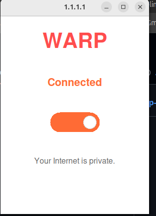

# 🚀 WARP GUI Toggle



A simple desktop GUI to enable or disable Cloudflare WARP (`warp-cli`) in Linux systems.

## 📦 Features

- ✅ One-click WARP connect/disconnect
- 🖼️ User-friendly GUI with Tkinter
- 🐍 Built with Python 3
- 🧑‍💻 No command-line usage required after setup

## ⚠️ Important Note

❗ This GUI requires **Cloudflare WARP CLI (`1111`)** to be **installed and configured first**.  
Otherwise, the GUI will not work.

## 🛠️ Install Cloudflare WARP (1111) on Ubuntu

```bash
curl -fsSL https://pkg.cloudflareclient.com/pubkey.gpg | sudo gpg --dearmor -o /usr/share/keyrings/cloudflare-warp-archive-keyring.gpg

echo 'deb [signed-by=/usr/share/keyrings/cloudflare-warp-archive-keyring.gpg] https://pkg.cloudflareclient.com/ focal main' | sudo tee /etc/apt/sources.list.d/cloudflare-client.list

sudo apt update
sudo apt install cloudflare-warp

warp-cli register
warp-cli connect

✅ Check status:
warp-cli status

🖥️ System Requirements
✅ Linux (Ubuntu/Debian)
✅ Python 3.7+
✅ pip
✅ warp-cli (1111)

🔧 Setup Instructions
git clone https://github.com/YOUR_USERNAME/warp_gui_toggle.git
cd warp_gui_toggle
python3 -m venv venv
source venv/bin/activate
pip install -r requirements.txt
python3 src/warp_gui.py

⚙️ Run the Pre-built Executable
cd dist
chmod +x warp_gui
./warp_gui

📁 Project Structure
warp_gui_toggle/
├── dist/
├── src/
├── assets/
│   └── logo.png
├── README.md
├── LICENSE

🧪 Build Your Own Executable
pyinstaller --onefile src/warp_gui.py -n warp_gui


🤝 Contributing
Fork the repository
Make changes
Submit a Pull Request

📄 License
MIT License

Made with ❤️ by Aqib Sami  from opencode — Swat, Pakistan 🇵🇰


